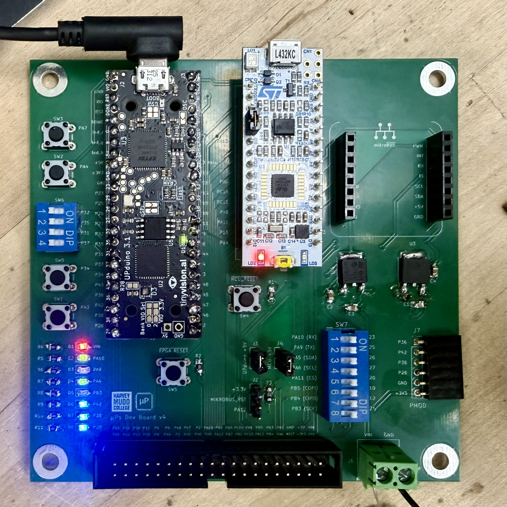
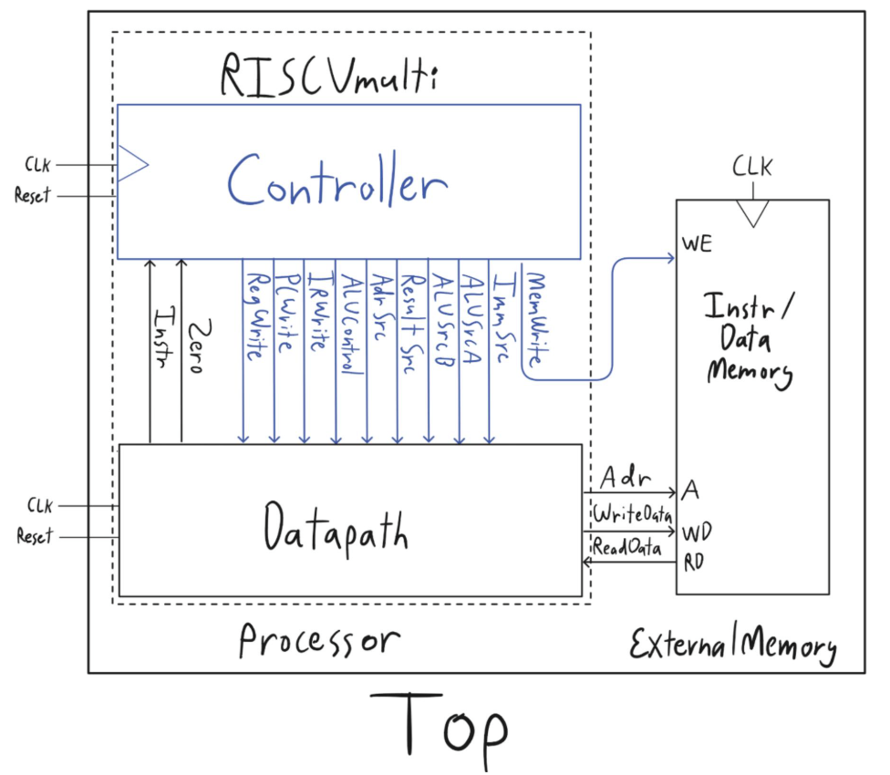
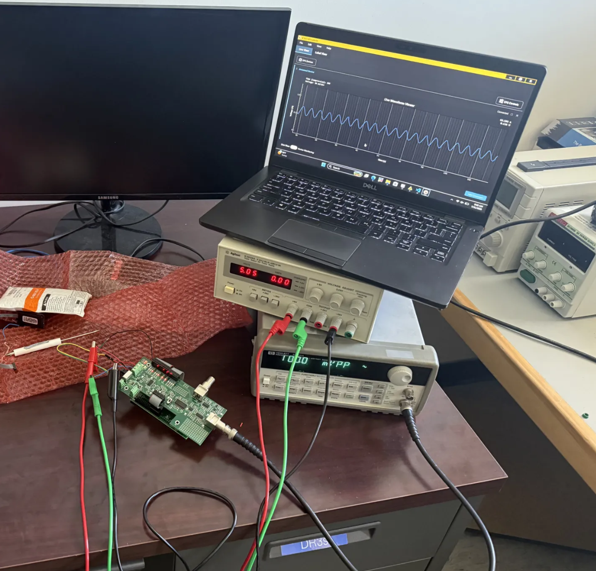
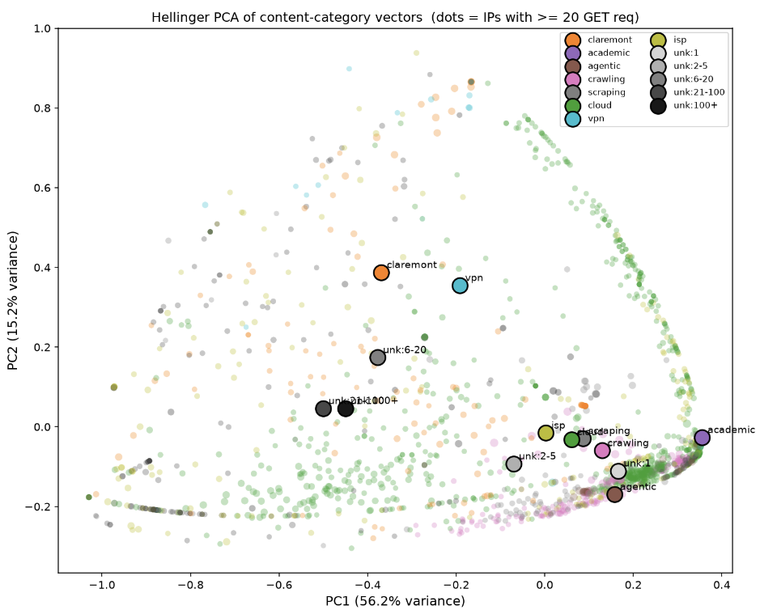
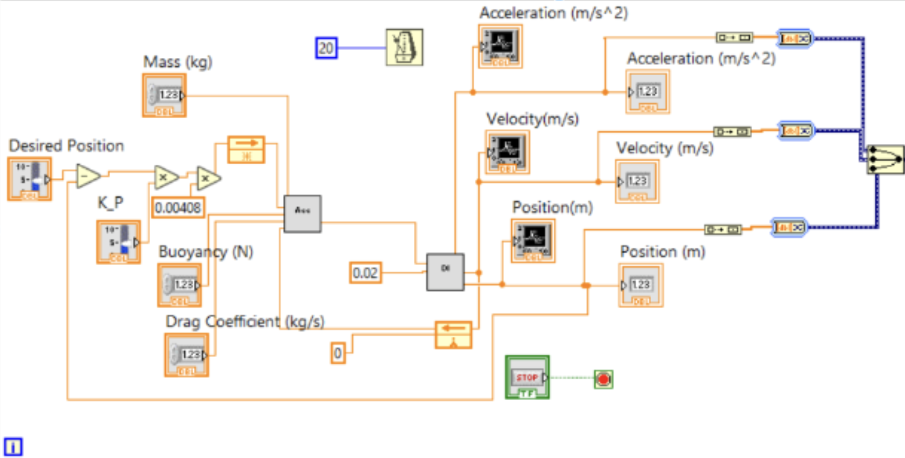

Zachary Wood is a junior computer science major at
[Harvey Mudd College](https://hmc.edu). Their academic and career interests
are in computer engineering, particularly FPGA and digital circuit design and
verification, computer architecture for CPUs and GPUs, and analog circuit
design for sensors and mixed-signal ASICs. They are a member of the Harvey
Mudd Analog Circuit Engineering (ACE) Lab, headed by
[Matthew Spencer](https://www.hmc.edu/engineering/matthew-spencer/), and the
Harvey Mudd Sustainability and Network Design (SAND) Lab, headed by
[Arthi Padmanabhan](https://artpad6.github.io/). Outside of computer
engineering, they can be found bouldering, practicing Brazilian Jiu-Jitsu,
reading and writing fantasy and science fiction, or studying Mandarin.

---

```{=html}
<div class="proj-grid">
  <a class="proj-card" href="labs.html">
    
    <div class="proj-label">
      <p class="proj-context">Coursework</p>
      <p class="proj-name">Microprocessor Systems Labs</p>
    </div>
  </a>

  <a class="proj-card" href="projects.html#riscv">
    
    <div class="proj-label">
      <p class="proj-context">Coursework</p>
      <p class="proj-name">Multicycle RISC-V Processor</p>
    </div>
  </a>

  <a class="proj-card" href="experience.html#ace-lab">
    
    <div class="proj-label">
      <p class="proj-context">ACE Lab</p>
      <p class="proj-name">EPG Sensor Firmware</p>
    </div>
  </a>

  <a class="proj-card" href="experience.html#sand-lab">
    
    <div class="proj-label">
      <p class="proj-context">SAND Lab</p>
      <p class="proj-name">Bot Traffic Energy Analysis</p>
    </div>
  </a>

  <a class="proj-card" href="projects.html#rov">
    
    <div class="proj-label">
      <p class="proj-context">Coursework</p>
      <p class="proj-name">Submersible ROV</p>
    </div>
  </a>

</div>
```
