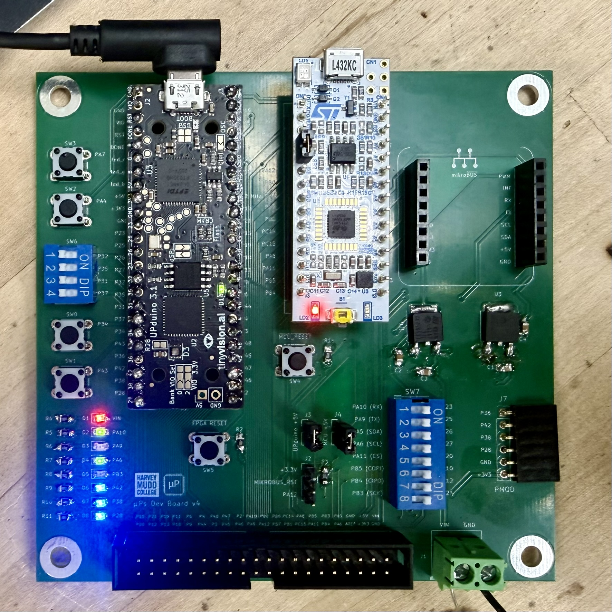
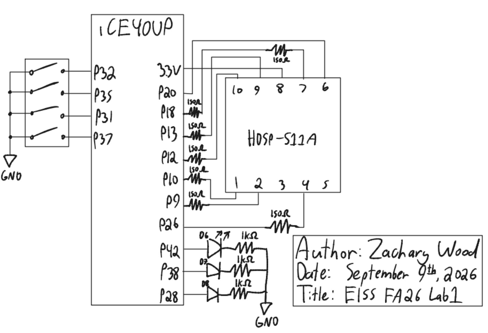

## Lab 1: FPGA and MCU Setup and Testing

## Introduction

The goal of this lab was to become familiarized with the microcontroller unit (MCU) and field-programmable gate array (FPGA) used this semester. I assembled a [development board](https://hmc-e155.github.io/assets/doc/E155%20Development%20Board%20Schematic.pdf) containing a [Nucleo-L432KC MCU](https://hmc-e155.github.io/assets/doc/ds11451-stm32l432kc.pdf) and an [UPduino v3.1](https://upduino.readthedocs.io/en/latest/index.html#) Lattice iCE40UP5K FPGA development board, wrote and verified SystemVerilog modules to control three on-board LEDs and an external 7-segment display using four on-board DIP switches, and programmed the FPGA with my synethsised design.

[Specs](https://hmc-e155.github.io/lab/lab1/specs.html)

## Design and Testing Methodology

### Development Board Assembly

The development board contains several components, including pins which can be directly routed from the MCU to the FPGA, extension headers for the mikroBUS and 6-pin PMOD standard, user configurable LEDs, pushbuttons, slider switches, and a header to route pins via a ribbon cable to a separate breadboard adapter PCB which can be inserted into a solderless breadboard.



### FPGA Implementation

The top-level module had the following inputs and outputs:

| Signal Name | Signal Type | Description |
|---|---|---|
| `rst_n` | input | active-low reset button (internal pull-up), used to reset the blink counter during simulation |
| `s[3:0]` | input | the four DIP switches (on-board, SW6) |
| `led[2:0]` | output | 3 LEDs (on-board, D6-D8) |
| `seg[6:0]` | output | the segments of a common-anode 7-segment display, used to display the hexadecimal digit of `s[3:0]` |

There is no clock signal in the inputs because the 48 MHz clock is generated inside the FPGA by the **HSOSC** (High-Speed OSCillator) primitive.

`led[0]` is `s[1] ^ s[0]`, `led[1]` is `s[2] & s[3]`, and `led[2]` blinks at 2.4 Hz. I chose to divide the clock with a counter with a settable max and then used comparison to achieve a 2.4 Hz square wave.

`seg[6:0]` was generated by a 7-segment decoder submodule containing a unique case block. To differentiate 0/D and 8/B, I made 'd' and 'b' lowercase.

## Technical Documentation

The source code for the project can be found in the associated [Github repository](https://github.com/wood-zachary/hmc-e155-portfolio/tree/main/labs/lab1).

### Block Diagram

Figure 1 shows the block diagram of the design. The top-level module `lab1_zw` includes three submodules: the high-speed oscillator (`hf_osc`, an `HSOSC` primitive), a counter (`cnt`) used as divide the clock, and a seven-segment decoder (`sev_seg_dec`). `rst_n` is inverted before driving the counter's active-high `rst` port, and the counter's `en` is tied high so it runs continuously. The counter's 25-bit output `q` is compared against `25'd10,000,000` to produce an approximately 50% duty 2.4 Hz square wave on `led[2]`. `led[0]` and `led[1]` are generated directly from `s[3:0]` with an XOR and AND gate respectively, and `s[3:0]` is also passed to the decoder to produce `seg[6:0]`.


### Schematic

Figure 2 shows the schematic of the physical circuit. The four DIP switches (`s[3:0]`) are wired to FPGA pins P32, P35, P31, and P37, with the other terminal of each switch tied to GND. The FPGA's internal pull-up resistors on these pins provide the high level when a switch is open. The seven-segment display is an HDSP-511A (deep red, common anode). Its common anode is tied directly to 3.3V, and each of its 7 segment cathodes is driven from an FPGA pin through its own 150 Ω current-limiting resistor, so every segment draws the same current regardless of how many segments are lit at once. The three on-board LEDs (D6, D7, D8) are each driven through their own 1 kΩ series resistor to GND.



#### Calculations

**Segment current.** Per the HDSP-511A datasheet, each segment has a typical forward voltage $V_{ON} = 2.00\text{ V}$ at $I_F = 20\text{ mA}$, with an absolute maximum continuous forward current of 20 mA per segment. With the display's common anode at $V_{DD} = 3.3\text{ V}$ and a 150 Ω series resistor per segment:

$$I_F = \frac{V_{DD} - V_{ON}}{R} = \frac{3.3\text{ V} - 2.00\text{ V}}{150\ \Omega} \approx 8.7\text{ mA}$$

This falls within the lab's recommended 5-10 mA range and well under the segment's 20 mA absolute maximum rating.

**Blink frequency.** The HSOSC primitive generates a nominal 48 MHz clock. The counter divides this down with `MAX = 25'd19_999_999`, wrapping every 20,000,000 cycles:

$$f_{wrap} = \frac{48\times10^6\text{ Hz}}{20\times10^6} = 2.4\text{ Hz}$$

`led[2]` is asserted whenever `cnt_q < 25'd10_000_000`, which is exactly the first half of each 20,000,000-cycle period, giving a 50% duty 2.4 Hz square wave. The counter needs at least $\lceil \log_2(20{,}000{,}000) \rceil = 25$ bits to represent `MAX`, matching the `N = 25` parameter used in the instantiation. This could have been lowered by generating a 6 MHz clock instead of a 48 MHz clock with the HSOSC primitive, per the [iCE40 Oscillator Usage Guide](https://hmc-e155.github.io/assets/doc/FPGA-TN-02008-1-7-iCE40-Oscillator-Usage-Guide.pdf).

## Results and Discussion

This design met the prescribed proficiency and excellence requirements in simulation. In QuestaSim, the seven-segment decoder was verified against all 16 possible input combinations, the counter's reset, enable, and max-count behaviors were each verified with targeted, self-checking assertions, and the top-level testbench confirmed correct switch-to-LED and switch-to-segment wiring as well as a functioning HSOSC clock. `led[0]` correctly implements `s[0] ^ s[1]`, `led[1]` correctly implements `s[2] & s[3]`, and `led[2]` blinks at exactly 2.4 Hz with a 50% duty cycle. All 16 hexadecimal digits display correctly and distinguishably, including visually similar pairs like 6/b and 0/D.

### Testbench Simulation

Figure 3 and Figure 4 show the seven-segment decoder and counter testbenches, respectively. Figure 5 shows the top-level testbench verifying all switch values.

::: {.callout-note collapse="true"}
## Seven-segment decoder testbench (click to expand)

:::

::: {.callout-note collapse="true"}
## Counter testbench (click to expand)

:::


## Conclusion

The dev board was assembled properly and the FPGA design successfully drove LEDs based on combinational logic, blinked an external LED using the on-board high-speed oscillator at 2.4 Hz, and controlled a seven segment display.

::: {.callout-note collapse="true"}
## Hours spent (click to expand)
I spent roughly 19 hours on this project.

For instructor reference: I spent 3 hours on Quarto set up and an initial reading of the lab materials, 6 hours on board PCB assembly and hardware debugging, 3 hours writing SystemVerilog modules and testbenches, 4 hours debugging the software toolchain used on the FPGA (Lattice Radiant issues with licensing and programming/flashing, setting up OpenFPGA), 1 hour on the AI prototype, and then 2 hours writing up the lab report.
:::

## AI Prototype Summary

The purpose of the AI Prototype is to experiment with utilizing AI as a coding assistant, and analyze the quality, speed, and precision that an LLM can generate code. The prompt for this week is shown below:

::: {.callout-tip}
## AI Prototype (Claude, incognito mode, Sonnet 5, high reasoning effort)
Prompt: "Write SystemVerilog HDL to leverage the internal high speed oscillator in the Lattice UP5K FPGA and blink an LED at 2 Hz. Take full advantage of SystemVerilog syntax, for example, using logic instead of wire and reg."
:::

::: {.callout-note collapse="true"}
## Generated Code (first attempt)
```systemverilog
//------------------------------------------------------------------------
// led_blink_2hz.sv
//
// Blinks an LED at BLINK_FREQ_HZ using the UP5K internal high-frequency
// oscillator (SB_HFOSC) as the sole clock source. No external clock or
// reset input is required; on an SRAM-based iCE40 device, all flip-flops
// power up to the state defined at synthesis (0 by default), so `count`
// and `led` both start at 0 without an explicit reset path.
//------------------------------------------------------------------------

module led_blink_2hz #(
    // CLK_FREQ_HZ must match the CLKHF_DIV setting on the SB_HFOSC
    // instance below:
    //   "0b00" = 48 MHz (default)   "0b01" = 24 MHz
    //   "0b10" = 12 MHz             "0b11" = 6 MHz
    parameter int CLK_FREQ_HZ   = 12_000_000,
    parameter int BLINK_FREQ_HZ = 2
) (
    output logic led
);

    //----------------------------------------------------------------------
    // Internal high-frequency oscillator
    //----------------------------------------------------------------------
    logic clk;

    SB_HFOSC #(
        .CLKHF_DIV("0b10")
    ) u_hfosc (
        .CLKHFPU(1'b1),
        .CLKHFEN(1'b1),
        .CLKHF  (clk)
    );

    //----------------------------------------------------------------------
    // Toggle counter: one toggle every quarter blink period
    //----------------------------------------------------------------------
    localparam int TOGGLE_COUNT = CLK_FREQ_HZ / (BLINK_FREQ_HZ * 2);
    localparam int CNT_WIDTH    = $clog2(TOGGLE_COUNT);

    logic [CNT_WIDTH-1:0] count;

    always_ff @(posedge clk) begin
        if (count == TOGGLE_COUNT - 1) begin
            count <= '0;
            led   <= ~led;
        end else begin
            count <= count + 1'b1;
        end
    end

endmodule
```
:::

This first version failed to synthesize in Lattice Radiant:

```
35901063  Error  ../../led_blink_2hz.sv(36): instantiating unknown module SB_HFOSC. VERI-1063  [led_blink_2hz.sv:36]
```

I gave Claude the error with no other context and it provided a reasonable explanation for the issue: `SB_HFOSC` is the name used by the older iCEcube2 and the open-source Yosys/nextpnr toolchains, while Lattice Radiant only recognizes the oscillator under the name `HSOSC`. It also suggested that if the `CLKHF_DIV` string literal `"0b10"` were ever rejected, the vector form `2'b10` was worth trying instead, since Lattice's own examples use both notations inconsistently. It then returned a corrected version with the primitive renamed and a comment explaining the change.

::: {.callout-note collapse="true"}
## Generated Code (corrected)
```systemverilog
//------------------------------------------------------------------------
// led_blink_2hz.sv
//
// Blinks an LED at BLINK_FREQ_HZ using the UP5K internal high-frequency
// oscillator (SB_HFOSC) as the sole clock source. No external clock or
// reset input is required; on an SRAM-based iCE40 device, all flip-flops
// power up to the state defined at synthesis (0 by default), so `count`
// and `led` both start at 0 without an explicit reset path.
//------------------------------------------------------------------------

module led_blink_2hz #(
    // CLK_FREQ_HZ must match the CLKHF_DIV setting on the SB_HFOSC
    // instance below:
    //   "0b00" = 48 MHz (default)   "0b01" = 24 MHz
    //   "0b10" = 12 MHz             "0b11" = 6 MHz
    parameter int CLK_FREQ_HZ   = 12_000_000,
    parameter int BLINK_FREQ_HZ = 2
) (
    output logic led
);

    //----------------------------------------------------------------------
    // Internal high-frequency oscillator
    //----------------------------------------------------------------------
    logic clk;

    // Lattice Radiant names this primitive HSOSC; the older iCEcube2
    // toolchain and the open-source Yosys/nextpnr flow use SB_HFOSC
    // instead. Port names (CLKHFPU, CLKHFEN, CLKHF) are identical
    // between the two.
    HSOSC #(
        .CLKHF_DIV("0b10")
    ) u_hfosc (
        .CLKHFPU(1'b1),
        .CLKHFEN(1'b1),
        .CLKHF  (clk)
    );

    //----------------------------------------------------------------------
    // Toggle counter: one toggle every quarter blink period
    //----------------------------------------------------------------------
    localparam int TOGGLE_COUNT = CLK_FREQ_HZ / (BLINK_FREQ_HZ * 2);
    localparam int CNT_WIDTH    = $clog2(TOGGLE_COUNT);

    logic [CNT_WIDTH-1:0] count;

    always_ff @(posedge clk) begin
        if (count == TOGGLE_COUNT - 1) begin
            count <= '0;
            led   <= ~led;
        end else begin
            count <= count + 1'b1;
        end
    end

endmodule
```
:::

Reflection: The corrected code synthesized successfully in Lattice Radiant on the second attempt. In terms of quality, the output seems clean and idiomatic: it used `logic`, parameterized the clock frequency and blink frequency, derived the counter width with `$clog2`, and used underscore-separated numeric literals for readability. However, per personal preference, I find the amount of comments excessive.

The mistake Claude made was assuming the open-source Yosys/nextpnr primitive name (`SB_HFOSC`) would be used instead of Lattice Radiant's (`HSOSC`). Ideally, Claude would predict that issue in advance and ask which toolchain was in use before generating any code. However, I also could have provided the information about the toolchain myself, and I would normally do so if I were to ask Claude to generate code like this.
