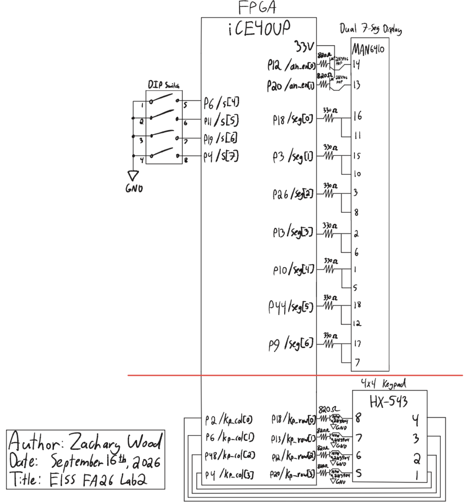

## Introduction

The goal of this lab was to learn how to use time multiplexing to efficiently use the I/O on an FPGA. I Implemented a time-multiplexing scheme to drive two seven-segment displays with a single set of FPGA I/O pins, built a simple transistor circuit to drive large currents from the FPGA pins, and installed a keypad and verified that logic signals can pass through it.

## Design and Testing Methodology

### FPGA Implementation

The top-level module (`lab2_zw`) has the following inputs and outputs:

| Signal Name | Signal Type | Description |
|---|---|---|
| `rst_n` | input | active-low push button (internal pull-up) that resets the multiplexing and scanning counters |
| `s[7:0]` | input | DIP switches: `s[3:0]` is digit 0 (on-board, SW6), `s[7:4]` is digit 1 (breadboard) |
| `kp_col[3:0]` | input | keypad column inputs |
| `led[3:0]` | output | on-board LEDs, driven by the scanned keypad columns |
| `seg[6:0]` | output | shared segment lines, time multiplexed between both digits |
| `an_en[1:0]` | output | anode enable outputs, exactly one high at a time to select the active digit |
| `kp_row[3:0]` | output | one-hot row output that scans the keypad |

As in lab 1, the 48 MHz clock comes from the internal `HSOSC` primitive, so there is no clock input. A 16-bit counter (`mux_cnt`) toggles which digit is active every 24,000 cycles (500 microseconds), a 1 kHz per-digit refresh rate with no visible flicker or bleeding, and `digit_data` feeds a single shared `seven_seg_decoder` instance reused from lab 1. A second, 25-bit counter inside `keypad_scanner` produces the one-hot `kp_row[3:0]` scan pattern, asserting each row for 6,000,000 of its 24,000,000 cycles, resulting in a 2 Hz toggle rate. `kp_col[3:0]` is inverted directly into `led[3:0]`, and since each row driver is open-collector and each column is independently pulled up by internal pull-up resistors, multiple simultaneous key presses read back correctly.

## Technical Documentation

The source code for the project can be found in the associated [Github repository](https://github.com/wood-zachary/hmc-e155-portfolio/tree/main/labs/lab2).

### Block Diagram

Figure 1 shows the top-level architecture of `lab2_zw`. `HSOSC` generates `int_osc`, which clocks both counter instances. The multiplexing counter's count is compared against `16'd24,000` to select `digit_data` (`s[3:0]` or `s[7:4]`) and `an_en[1:0]` for the shared decoder and anode drivers, while the scanning counter's output logic produces `kp_row[3:0]` directly. `rst_n` is inverted into both counters' `rst` ports, and `kp_col[3:0]` is inverted onto `led[3:0]`.


### Schematic

Figure 2 shows the schematic of the physical circuit. The display is a common-anode dual seven-segment display, driven by one 2N3906 PNP transistor per digit with an 820 Ω base resistor, and 330 Ω current-limiting resistors on each shared segment cathode. The keypad is a 4x4 matrix keypad, with each row driven through a 2N3904 NPN transistor wired as an open-collector output (also 820 Ω base resistors), and columns read back through the FPGA's internal pull-ups.

A single combined pin assignment would have required routing some signals through pins tied to the UPduino's on-board LEDs, causing distracting LED activity, so the display multiplexing and keypad scanning were synthesized and tested as two separate builds sharing the same HDL modules.



#### Calculations

**Segment current.** Per the MAN6410 datasheet, each segment has a typical forward voltage $V_{ON} = 2.1\text{ V}$ (max 2.8 V) at $I_F = 20\text{ mA}$, with an absolute maximum continuous forward current of 30 mA per segment. The 150 Ω series resistors I used in lab 1 would have put the segment current right at the 8 mA $I_{OL}$ maximum, so I replaced them with 330 Ω series resistors. With $V_{DD} = 3.3\text{ V}$:

$$I_F = \frac{V_{DD} - V_{ON}}{R} = \frac{3.3\text{ V} - 2.1\text{ V}}{330\ \Omega} \approx 3.6\text{ mA}$$

comfortably under the 8 mA maximum.

**Transistor base current.** Both the 2N3906 and 2N3904 transistors use an 820 Ω base resistor. With a standard silicon $V_{BE(on)} = 0.7\text{ V}$:

$$I_B = \frac{V_{DD} - V_{BE(on)}}{R_B} = \frac{3.3\text{ V} - 0.7\text{ V}}{820\ \Omega} \approx 3.2\text{ mA}$$

well under the FPGA's 8 mA maximum.

**Multiplexing and scanning rates.** `HSOSC` defaults to 48 MHz. The mux counter (`MAX = 16'd47_999`) toggles digits every 24,000 cycles, resulting in a 1 kHz toggle rate between digits. The scan counter (`MAX = 25'd23_999_999`) asserts each row for 6,000,000 of 24,000,000 cycles, resulting in a 2 Hz toggle rate across all 4 rows.

## Results and Discussion

This design meets all of the lab's proficiency and excellence requirements. Both digits display correctly with consistent brightness, since every segment shares an identical 330 Ω resistor and only one digit's anode is enabled at a time, and the 1 kHz refresh rate avoids visible flicker or bleeding. The keypad scanning signal correctly drives `led[3:0]` under all keypress conditions, including multiple simultaneous presses, since each row driver is open-collector and each column is independently pulled up by internal pull-up resistors.

The top-level module only contains instances of `HSOSC`, the decoder, and the two counter modules, plus assign statements; `keypad_scanner` only instances a counter and an assign statement; and both counters are parametrized instances of my lab 1 `counter` module. The design was verified as two separate hardware builds rather than one combined build to avoid pin conflicts with the on-board LEDs, and both builds functioned correctly.

### Testbench Simulation

As specified, the lab 1 seven-segment decoder and counter simulations were not repeated, since those modules were already verified there.

::: {.callout-note collapse="true"}
## Keypad scanner testbench (click to expand)

:::

![Figure 4: QuestaSim waveform for `lab2_zw_tb`, showing `an_en`/`seg` multiplexing between `s[7:4]` and `s[3:0]`, and `led` tracking `kp_col`.](images/lab2_top_tb_waveform.png)

## Conclusion

This lab successfully demonstrated time-multiplexing a shared seven-segment decoder across two digits, and using transistors to move current-driving work off the FPGA's pins: a PNP transistor sources each digit's anode current, and an NPN transistor forms an open-collector row driver for the keypad.

::: {.callout-note collapse="true"}
## Hours spent (click to expand)
I spent roughly 15 hours on this project.

For instructor reference: I spent 2.5 hours on an initial block diagram and schematic, 1 hour on writing the two new modules and finishing my block diagram, 1.5 hours writing testbenches for the two new modules and simulating them, 5 hours assembling the hardware and finishing my schematic, 2 hours physically testing and debugging the hardware, 1 hour completing the AI prototype, and 2 hours writing this lab report.
:::

## AI Prototype Summary

The purpose of the AI Prototype is to experiment with utilizing AI as a coding assistant, and analyze the quality, speed, and precision that an LLM can generate code. The prompt for this week is shown below:

::: {.callout-tip}
## AI Prototypes (Claude, incognito mode, Sonnet 5, high reasoning effort)
"Write SystemVerilog HDL to time multiplex a single seven segment decoder (that decodes from four bits to a common anode seven segment display) to decode two sets of input bits and drive two sets of seven output bits."

:::

::: {.callout-tip}
## AI Prototypes (Claude, incognito mode, Sonnet 5, high reasoning effort, lab 1 counter.sv and seven_seg_decoder.sv attached as context)
"Write SystemVerilog HDL to time multiplex a single seven segment decoder (that decodes from four bits to a common anode seven segment display) to decode two sets of input bits and drive two sets of seven output bits. Use the seven segment decoder and oscillator provided in the attached files."

:::

::: {.callout-note collapse="true"}
## Generated code, prompt 1
```systemverilog
// =============================================================================
// seg7_decode
// Combinational 4-bit binary to seven-segment decoder.
// Common anode display, active-low segment outputs.
// Segment bit order: seg[6:0] = {g, f, e, d, c, b, a}
// =============================================================================
module seg7_decode (
    input  logic [3:0] value,
    output logic [6:0] seg
);

    always_comb begin
        unique case (value)
            4'h0:    seg = 7'b1000000;
            4'h1:    seg = 7'b1111001;
            4'h2:    seg = 7'b0100100;
            4'h3:    seg = 7'b0110000;
            4'h4:    seg = 7'b0011001;
            4'h5:    seg = 7'b0010010;
            4'h6:    seg = 7'b0000010;
            4'h7:    seg = 7'b1111000;
            4'h8:    seg = 7'b0000000;
            4'h9:    seg = 7'b0010000;
            4'hA:    seg = 7'b0001000;
            4'hB:    seg = 7'b0000011;
            4'hC:    seg = 7'b1000110;
            4'hD:    seg = 7'b0100001;
            4'hE:    seg = 7'b0000110;
            4'hF:    seg = 7'b0001110;
            default: seg = 7'b1111111;
        endcase
    end

endmodule

// =============================================================================
// seg7_time_mux2
// Time-multiplexes a single seg7_decode instance across two 4-bit inputs.
// Each output bus is registered and holds its decoded value between
// updates, so both displays remain static rather than blinking.
// =============================================================================
module seg7_time_mux2 (
    input  logic       clk,
    input  logic       rst,
    input  logic [3:0] value0,
    input  logic [3:0] value1,
    output logic [6:0] seg0,
    output logic [6:0] seg1
);

    logic       sel;
    logic [3:0] value_mux;
    logic [6:0] seg_dec;

    assign value_mux = sel ? value1 : value0;

    seg7_decode u_seg7_decode (
        .value (value_mux),
        .seg   (seg_dec)
    );

    always_ff @(posedge clk) begin
        if (rst) begin
            sel  <= 1'b0;
            seg0 <= 7'b1111111;
            seg1 <= 7'b1111111;
        end else begin
            sel <= ~sel;
            if (sel) begin
                seg1 <= seg_dec;
            end else begin
                seg0 <= seg_dec;
            end
        end
    end

endmodule
```
:::

::: {.callout-note collapse="true"}
## Generated code, prompt 2 (with lab 1 files attached)
```systemverilog
module seven_seg_mux #(
    parameter int N = 17,
    parameter logic [N-1:0] MAX = 17'd99_999
) (
    input  logic       clk,
    input  logic       rst,

    input  logic [3:0] digit0,
    input  logic [3:0] digit1,

    output logic [6:0] seg,
    output logic [1:0] an
);

    logic [N-1:0] refresh_count;
    logic         refresh_tick;
    logic         digit_sel;
    logic [3:0]   digit_mux;

    counter #(
        .N   (N),
        .MAX (MAX)
    ) refresh_counter (
        .clk (clk),
        .rst (rst),
        .en  (1'b1),
        .q   (refresh_count)
    );

    assign refresh_tick = (refresh_count == MAX);

    counter #(
        .N   (1),
        .MAX (1'b1)
    ) digit_sel_counter (
        .clk (clk),
        .rst (rst),
        .en  (refresh_tick),
        .q   (digit_sel)
    );

    assign digit_mux = digit_sel ? digit1 : digit0;

    seven_seg_decoder decoder (
        .s   (digit_mux),
        .seg (seg)
    );

    always_comb begin
        an            = 2'b11;
        an[digit_sel] = 1'b0;
    end

endmodule
```
:::

Reflection: Without any lab context, the first prompt's design time-multiplexed the decoder's combinational logic, but latched the two digits onto two entirely separate 7-bit output buses, an architecture that only works if the board exposes two independent segment buses rather than the single, anode-multiplexed bus we use in this lab. It did mention that a shared bus would instead need a slow anode-select clock divider, but did not generate that version. With lab 1's `counter` and `seven_seg_decoder` modules attached as context, the second prompt generated two instances of the existing `counter` module (one free-running for the refresh period, one a 1-bit toggle clocked by the first's terminal count) driving a single `seven_seg_decoder` instance through a 2:1 mux, with `an[1:0]` selecting the active digit. Giving the model the actual modules to reuse, rather than describing the goal in the abstract, got the LLM to infer the actual physical constraint (one shared segment bus).
