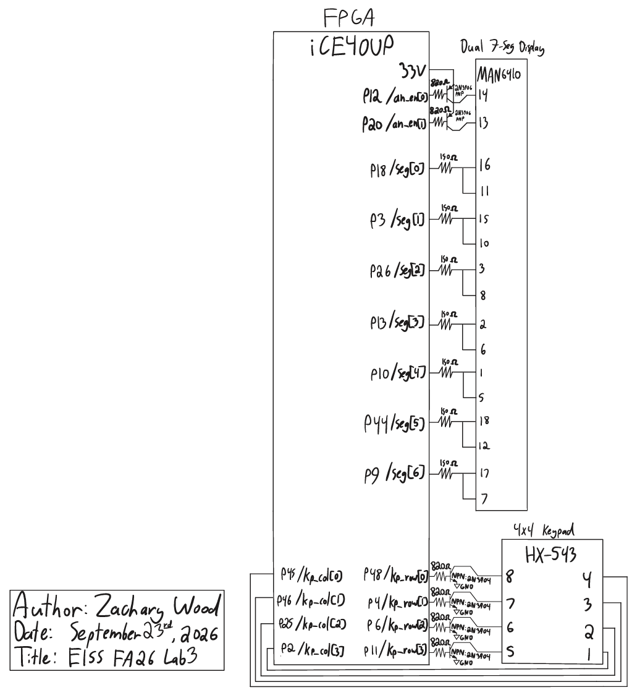

## Introduction

The goal of this lab was to read a 4x4 matrix keypad with the FPGA and display the last two hexadecimal digits pressed on the dual seven-segment display from lab 2. I synchronized and debounced the keypad's column inputs, designed a keypad scanner finite state machine (FSM) that registers each press exactly once and tolerates multiple simultaneous presses, and verified each new module and updated module with a self-checking testbench before testing the design on hardware.

## Design and Testing Methodology

### FPGA Implementation

The top-level module (`lab3_zw`) has the following inputs and outputs:

| Signal Name | Signal Type | Description |
|---|---|---|
| `rst_n` | input | active-low push button (internal pull-up) that resets the entire design |
| `kp_col_async[3:0]` | input | asynchronous, active-low keypad column inputs (internal pull-ups) |
| `seg[6:0]` | output | shared segment lines, time multiplexed between both digits |
| `an_en[1:0]` | output | anode enable outputs, exactly one high at a time to select the active digit |
| `kp_row[3:0]` | output | one-hot row output that scans the keypad |

Each column passes through a two-stage `synchronizer` and then a `debouncer` before reaching `keypad_scanner`. The synchronizers reset to 1, since the columns are active low and idle high. `keypad_scanner` drives the row scan, detects and decodes key presses, and holds the two most recent digits in `digit0` (newest) and `digit1`. The display multiplexing is reused from [lab 2](../lab2/lab2.qmd), and the `counter` and `seven_seg_decoder` modules are reused from [lab 1](../lab1/lab1.qmd). Every register is clocked by the 48 MHz `HSOSC` output, and the slower scan, debounce, and multiplexing rates are generated with counters.

The keypad scanner's 25-bit counter asserts each row for 6,000,000 cycles (125 ms). It only advances while the scanner is in its SCAN state and no debounced column is low, so the row stays fixed while a key is held. The driven row and the debounced columns are decoded together into a hexadecimal value, with the `*` and `#` keys displayed as F and E, respectively.

### Finite State Machines

The design contains two canonical FSMs, the debouncer and the keypad scanner, each communicating with its own instantiated counter. Both route the unused encoding `2'b11` to their reset states through a `default` branch.

**Keypad scanner.** In SCAN, the rows are scanned while no key is down. When exactly one column reads low (`single_key`), the FSM moves to PRESS. If several columns read low, it stays in SCAN with the scan frozen and registers nothing. PRESS lasts one cycle and asserts `load`, which shifts `digit0` into `digit1`, stores the decoded key in `digit0`, and records the pressed column in `held_col`. HOLD waits for every key to be released. Additional keys pressed during HOLD either produce a multi-column reading or, if they are in another row, are not visible at all, so they are ignored. If the reading changes to a different single column (`new_col`), as happens when all but one of several held keys are released, the FSM returns to PRESS and registers that key. A remaining key in a different row is registered once the scan resumes and reaches its row.


| Current State | `any_key` | `single_key` | `new_col` | Next State |
|---|---|---|---|---|
| SCAN | X | 0 | X | SCAN |
| SCAN | X | 1 | X | PRESS |
| PRESS | X | X | X | HOLD |
| HOLD | 0 | X | X | SCAN |
| HOLD | 1 | 0 | X | HOLD |
| HOLD | 1 | 1 | 0 | HOLD |
| HOLD | 1 | 1 | 1 | PRESS  |
| unused | X | X | X | SCAN |

| Current State | `load` | `scan_en` |
|---|---|---|
| SCAN | 0 | `!any_key` |
| PRESS | 1 | 0 |
| HOLD | 0 | 0 |
| unused | 0 | 0 |

When `load` is asserted, the next clock edge loads `digit0 <= key`, `digit1 <= digit0`, and `held_col <= kp_col`. `scan_en` enables the row scan counter.

**Debouncer.** In IDLE, `db_clr` holds the debounce counter at zero. A low input moves the FSM to WAIT, where the counter runs. Any return high during WAIT is treated as a bounce and returns the FSM to IDLE, clearing the counter. Once `db_count[19]` is set, after $2^{19}$ consecutive low cycles, the FSM enters PRESSED and drives `btn_out` low until the input returns high.


| Current State | `btn_in` | `db_count[19]` | Next State |
|---|---|---|---|
| IDLE | 1 | X | IDLE |
| IDLE | 0 | X | WAIT |
| WAIT | 1 | X | IDLE |
| WAIT | 0 | 0 | WAIT |
| WAIT | 0 | 1 | PRESSED |
| PRESSED | 0 | X | PRESSED |
| PRESSED | 1 | X | IDLE |
| unused | X | X | IDLE |

| Current State | `btn_out` | `db_clr` |
|---|---|---|
| IDLE | 1 | 1 |
| WAIT | 1 | 0 |
| PRESSED | 0 | 0 |
| unused | 1 | 0 |

### Debouncing Strategy

Each column is debounced independently by its own `debouncer`, placed after the synchronizer so that it only sees synchronous inputs. A press is confirmed only after 10.9 ms of continuous low input, and releases are accepted immediately, since a release bounce shorter than 10.9 ms can only move the debouncer into WAIT. A single debounce timer shared by all columns and sequenced by the scanner FSM would use one counter instead of four, but it would couple the debounce timing to the scan logic and add states to the scanner. I chose per-column debouncers because they keep the scanner FSM simple and can be tested in isolation, at the cost of four 20-bit counters.

### FSM Partitioning

The design is partitioned into communicating FSMs. Each debouncer's FSM communicates with its counter through `db_clr` and `db_count[19]`. The four debounced columns (`kp_col_db`) are the only interface between the debouncers and `keypad_scanner`, whose FSM communicates with the scan counter through `scan_en` and receives `kp_row` from the counter's output logic. The display multiplexing counter runs independently of both. Keeping the debouncing and scanning separate let me test each module on its own, at the cost of more modules and inter-module signals.

### Testing

Each new module has a self-checking testbench. The synchronizer testbench verifies the two-cycle latency for rising, falling, edge-aligned, and non-edge-aligned inputs, as well as an asynchronous reset in the middle of a shift. The debouncer testbench covers every state transition, including a bounce that aborts WAIT, the exact debounce threshold, recovery from the unused state encoding, and an asynchronous reset while PRESSED. The keypad scanner testbench models the physical keypad, deriving `kp_col` from `kp_row` and an array of held keys. It verifies all four row boundaries, all 16 decodes, a 200-cycle hold that registers only once, and each of the multiple-key cases in the specification. The top-level testbench applies an active-low key press with switch bounce and transitions at arbitrary positions relative to `int_osc`, including one directly on a clock edge, then checks that the press is synchronized, debounced, decoded, and displayed. The long debounce and multiplexing waits are skipped by forcing the relevant counters to their thresholds so I could waveforms legible.

On hardware, I tested each of the 16 keys individually, held keys down, pressed additional keys while holding one, released multi-key presses down to a single key, and pressed several keys at once.

## Technical Documentation

The source code for the project can be found in the associated [Github repository](https://github.com/wood-zachary/hmc-e155-portfolio/tree/main/labs/lab3).

### Block Diagram

Figure 3 shows the top-level architecture of `lab3_zw`. `HSOSC` generates `int_osc`, which clocks every submodule. Each bit of `kp_col_async[3:0]` passes through its own synchronizer (`sync0` through `sync3`) and debouncer (`debounce0` through `debounce3`) to form `kp_col_db[3:0]`, which feeds `kp_scanner`. `kp_scanner` drives `kp_row[3:0]` and outputs `digit0` and `digit1`. As in lab 2, `mux_count` from `mux_counter` is compared against `16'd24,000` to select `digit_out` and `an_en[1:0]`, and `sev_seg_dec` decodes `digit_out` onto `seg[6:0]`. `rst_n` is inverted for every submodule's `rst` port.


### Schematic

Figure 4 shows the schematic of the physical circuit. The display and keypad circuitry are unchanged from lab 2: each digit's common anode is driven by a 2N3906 PNP transistor with an $820\ \Omega$ base resistor, each shared segment cathode has a $330\ \Omega$ current-limiting resistor, and each keypad row is driven through a 2N3904 NPN transistor wired as an open-collector output. The columns are read through the FPGA's internal pull-ups, set to $3.3\text{ k}\Omega$ (`PULLMODE=3P3K`) in the pin constraints. On-board components are documented in the [development board schematic](https://hmc-e155.github.io/assets/doc/E155%20Development%20Board%20Schematic.pdf).



#### Calculations

**Segment and base currents.** The segment and base resistors are unchanged from lab 2, so each segment draws approximately 3.6 mA and each transistor base draws approximately 3.2 mA, both under the FPGA's 8 mA maximum.

which the row transistor sinks to ground.

**Debounce time.** A press is confirmed once `db_count[19]` is set, after $2^{19}$ cycles:

$$t_{db} = \frac{2^{19}}{48\times10^6\text{ Hz}} \approx 10.9\text{ ms}$$

**Scan and multiplexing rates.** As in lab 2, the scan counter (`MAX = 25'd23_999_999`) asserts each row for 6,000,000 cycles (125 ms), cycling through all four rows at 2 Hz, and the multiplexing counter (`MAX = 16'd47_999`) toggles the active digit every 24,000 cycles, resulting in a 1 kHz toggle rate between digits.

### Synthesis Results

<!-- TODO: synthesizer output?? -->

## Results and Discussion

This design meets all of the lab's proficiency and excellence requirements in both simulation and hardware. Each key press is registered exactly once regardless of how long it is held, the display holds its current values while multiple keys are pressed, and releasing all but one key registers the remaining key.

The main limitation of the design is the 2 Hz scan rate carried over from lab 2. Because the scan only freezes once a column has been debounced, a key registers only if it is held while its row is driven for the full 10.9 ms debounce window, so a quick tap that begins just after its row was scanned must be held for up to about 386 ms. I could have addressed this two ways. First, the scan could run much faster while keeping each row's dwell time longer than the debounce window, for example an 8 ms dwell with a 5.46 ms debounce window (`db_count[18]`), which reduces the worst-case hold time to about 35 ms. Second, the scan could freeze on the synchronized, pre-debounce columns (`kp_col_sync`) instead so that the row stays fixed while the debouncer runs. This would decouple the scan rate from the debounce time entirely, but would requires passing `kp_col_sync` into `keypad_scanner` as well.

### Testbench Simulation

Figures 5 through 7 show the synchronizer, debouncer, and keypad scanner testbenches. Figure 8 shows the top-level testbench, and Figure 9 zooms in on the end of the top-level simulation. The counter and seven-segment decoder simulations were not repeated, since those modules were verified in [lab 1](../lab1/lab1.qmd).

::: {.callout-note collapse="true"}
## Synchronizer testbench (click to expand)

:::

::: {.callout-note collapse="true"}
## Debouncer testbench (click to expand)

:::

::: {.callout-note collapse="true"}
## Keypad scanner testbench (click to expand)

:::


::: {.callout-note collapse="true"}
## Top-level testbench, zoomed (click to expand)

:::

## Conclusion

The design scanned the 4x4 keypad, synchronized and debounced its inputs, and displayed the last two keys pressed, registering each press once and handling multiple simultaneous presses as specified.

::: {.callout-note collapse="true"}
## Hours spent (click to expand)
I spent about 20 hours on this lab. For instructor refence, I spent  7 hours writing designing modules, 5 hours simulating my modules, 3 hours refactoring and debugging hardware, 3 hours on drawings (schematic, block diagram, FSMs), and 2 hours on the lab report
:::

## AI Prototype Summary

The purpose of the AI Prototype is to experiment with utilizing AI as a coding assistant, and analyze the quality, speed, and precision that an LLM can generate code.

::: {.callout-tip collapse="true"}
## Prototype A: monolithic prompt (Claude, Opus 5.5, high reasoning effort)
Target device: Lattice iCE40 UP5K FPGA with internal high-speed oscillator (~20 MHz).

Write synthesizable SystemVerilog to scan a 4x4 matrix keypad and display the last two hex keys pressed on a dual 7-segment display. Implement:

- A clock divider that derives a scan clock on the order of 100-200 Hz from the internal oscillator.
- A keypad scanning controller that iterates one active-low column at a time and samples active-low rows, registering at most one key per press (debounce-by-design), ignoring additional presses while any key is held, and allowing a new registration only after release.
- A top level that updates two hex digits (older and most recent) when a new key is registered and drives a time-multiplexed two-digit 7-segment display without visible flicker and with balanced brightness.

Use idiomatic SystemVerilog (e.g., logic, always_ff, enumerated states for FSMs). Provide clean module boundaries and keep all state synchronous. Include brief comments explaining the design choices.
:::

::: {.callout-note collapse="true"}
## Prototype A generated code
```systemverilog
// ============================================================================
// 4x4 keypad scanner with two-digit multiplexed hexadecimal display
// Target: Lattice iCE40 UP5K, internal high-frequency oscillator (HSOSC)
// ============================================================================

// ----------------------------------------------------------------------------
// sync_2ff
// Two-flop synchronizer for asynchronous inputs. Bits are synchronized
// independently. Incoherence between bits is harmless here: any mix of old
// and new row values is itself a valid keypad state, and the scanner
// resolves it on a later scan.
// ----------------------------------------------------------------------------
module sync_2ff #(
    parameter int unsigned WIDTH = 1
) (
    input  logic             clk,
    input  logic [WIDTH-1:0] d,
    output logic [WIDTH-1:0] q
);

  logic [WIDTH-1:0] meta;

  always_ff @(posedge clk) begin
    meta <= d;
    q    <= meta;
  end

endmodule

// ----------------------------------------------------------------------------
// tick_gen
// Produces a one-cycle enable pulse at TICK_HZ. An enable is used instead of
// a divided clock so that all registers remain in the single oscillator
// domain on the global clock network (no fabric-routed derived clock, no
// second clock domain, no clock-domain crossing).
// ----------------------------------------------------------------------------
module tick_gen #(
    parameter int unsigned CLK_HZ  = 24_000_000,
    parameter int unsigned TICK_HZ = 200
) (
    input  logic clk,
    input  logic rst,
    output logic tick
);

  localparam int unsigned DIV = CLK_HZ / TICK_HZ;
  localparam int unsigned CW  = (DIV > 1) ? $clog2(DIV) : 1;

  logic [CW-1:0] count;

  always_ff @(posedge clk) begin
    if (rst) begin
      count <= '0;
      tick  <= 1'b0;
    end else if (count == CW'(DIV - 1)) begin
      count <= '0;
      tick  <= 1'b1;
    end else begin
      count <= count + 1'b1;
      tick  <= 1'b0;
    end
  end

endmodule

// ----------------------------------------------------------------------------
// keypad_scanner
// Drives one active-low column per scan tick and samples the active-low
// rows at the end of that column's dwell time.
//
//   ARMED : the first active row found registers exactly one key
//           (single-cycle key_valid pulse) and the FSM moves to LOCKED.
//   LOCKED: scanning continues over all columns but nothing is registered.
//           The FSM re-arms only after RELEASE_SCANS consecutive full scans
//           with no active row, i.e. after every key has been released.
//
// Debounce by design: each key is sampled once per full scan (4 ticks,
// 20 ms at 200 Hz), which exceeds typical contact bounce. Press bounce is
// masked by the lock; release bounce is masked by requiring consecutive
// clean scans before re-arming. RELEASE_SCANS must be at least 1.
// ----------------------------------------------------------------------------
module keypad_scanner #(
    parameter int unsigned RELEASE_SCANS = 2
) (
    input  logic       clk,
    input  logic       rst,
    input  logic       scan_tick,
    input  logic [3:0] row_n,
    output logic [3:0] col_n,
    output logic       key_valid,
    output logic [3:0] key_code
);

  typedef enum logic {
    ARMED,
    LOCKED
  } state_t;

  localparam logic [1:0]  LAST_COL = 2'd3;
  localparam int unsigned RW       = (RELEASE_SCANS > 1) ?
                                     $clog2(RELEASE_SCANS) : 1;

  state_t        state;
  logic [1:0]    col_idx;
  logic [1:0]    col_next;
  logic [1:0]    row_idx;
  logic          row_hit;
  logic          press_seen;
  logic [RW-1:0] clean_scans;

  // Key layout (row 0 at top, column 0 at left):
  //   1 2 3 A
  //   4 5 6 B
  //   7 8 9 C
  //   E 0 F D   (* maps to E, # maps to F)
  function automatic logic [3:0] key_map(input logic [1:0] row,
                                         input logic [1:0] col);
    unique case ({row, col})
      4'h0: return 4'h1;
      4'h1: return 4'h2;
      4'h2: return 4'h3;
      4'h3: return 4'hA;
      4'h4: return 4'h4;
      4'h5: return 4'h5;
      4'h6: return 4'h6;
      4'h7: return 4'hB;
      4'h8: return 4'h7;
      4'h9: return 4'h8;
      4'hA: return 4'h9;
      4'hB: return 4'hC;
      4'hC: return 4'hE;
      4'hD: return 4'h0;
      4'hE: return 4'hF;
      4'hF: return 4'hD;
    endcase
  endfunction

  assign col_next = col_idx + 2'd1;
  assign row_hit  = ~&row_n;

  // Lowest-numbered active row wins if several rows are active.
  always_comb begin
    casez (row_n)
      4'b???0: row_idx = 2'd0;
      4'b??01: row_idx = 2'd1;
      4'b?011: row_idx = 2'd2;
      default: row_idx = 2'd3;
    endcase
  end

  // --- Column sequencer ------------------------------------------------------
  // col_n is registered and always equals the decode of col_idx, so at each
  // tick the synchronized rows reflect the column driven for the full
  // preceding dwell period.
  always_ff @(posedge clk) begin
    if (rst) begin
      col_idx <= 2'd0;
      col_n   <= 4'b1110;
    end else if (scan_tick) begin
      col_idx <= col_next;
      col_n   <= ~(4'b0001 << col_next);
    end
  end

  // --- Registration FSM ------------------------------------------------------
  always_ff @(posedge clk) begin
    if (rst) begin
      state       <= ARMED;
      press_seen  <= 1'b0;
      clean_scans <= '0;
      key_valid   <= 1'b0;
      key_code    <= 4'h0;
    end else begin
      key_valid <= 1'b0;
      if (scan_tick) begin
        unique case (state)
          ARMED: begin
            if (row_hit) begin
              state       <= LOCKED;
              key_valid   <= 1'b1;
              key_code    <= key_map(row_idx, col_idx);
              clean_scans <= '0;
              // Mark the current partial scan as dirty so it cannot count
              // toward release before the pressed column is re-sampled.
              press_seen  <= (col_idx != LAST_COL);
            end
          end

          LOCKED: begin
            if (col_idx == LAST_COL) begin
              press_seen <= 1'b0;
              if (press_seen || row_hit) begin
                clean_scans <= '0;
              end else if (clean_scans == RW'(RELEASE_SCANS - 1)) begin
                state       <= ARMED;
                clean_scans <= '0;
              end else begin
                clean_scans <= clean_scans + 1'b1;
              end
            end else begin
              press_seen <= press_seen | row_hit;
            end
          end
        endcase
      end
    end
  end

endmodule

// ----------------------------------------------------------------------------
// hex_to_seg
// Hexadecimal to seven-segment decoder. seg = {g, f, e, d, c, b, a},
// active high. Polarity for the physical display is applied at the top.
// ----------------------------------------------------------------------------
module hex_to_seg (
    input  logic [3:0] hex,
    output logic [6:0] seg
);

  always_comb begin
    unique case (hex)
      4'h0: seg = 7'b011_1111;
      4'h1: seg = 7'b000_0110;
      4'h2: seg = 7'b101_1011;
      4'h3: seg = 7'b100_1111;
      4'h4: seg = 7'b110_0110;
      4'h5: seg = 7'b110_1101;
      4'h6: seg = 7'b111_1101;
      4'h7: seg = 7'b000_0111;
      4'h8: seg = 7'b111_1111;
      4'h9: seg = 7'b110_1111;
      4'hA: seg = 7'b111_0111;
      4'hB: seg = 7'b111_1100;
      4'hC: seg = 7'b011_1001;
      4'hD: seg = 7'b101_1110;
      4'hE: seg = 7'b111_1001;
      4'hF: seg = 7'b111_0001;
    endcase
  end

endmodule

// ----------------------------------------------------------------------------
// display_mux
// Time-multiplexes two digits over shared segment lines. Each digit owns an
// identical slot of SLOT_CYCLES clocks, so both digits receive the same duty
// cycle and therefore the same brightness. The first BLANK_CYCLES of every
// slot disable all digits and segments so the previous digit driver turns
// off completely before new segment data appears (prevents ghosting).
// SLOT_HZ = 1 kHz yields a 500 Hz refresh per digit, well above the flicker
// fusion threshold. Outputs are active high and registered.
// ----------------------------------------------------------------------------
module display_mux #(
    parameter int unsigned CLK_HZ    = 24_000_000,
    parameter int unsigned SLOT_HZ   = 1_000,
    parameter int unsigned BLANK_DIV = 32
) (
    input  logic       clk,
    input  logic       rst,
    input  logic [3:0] hex_left,
    input  logic [3:0] hex_right,
    output logic [6:0] seg,
    output logic [1:0] digit_en
);

  localparam int unsigned SLOT_CYCLES  = CLK_HZ / SLOT_HZ;
  localparam int unsigned BLANK_CYCLES = SLOT_CYCLES / BLANK_DIV;
  localparam int unsigned CW           = (SLOT_CYCLES > 1) ?
                                         $clog2(SLOT_CYCLES) : 1;

  logic [CW-1:0] count;
  logic          sel_left;
  logic          blank;
  logic [6:0]    seg_left;
  logic [6:0]    seg_right;

  hex_to_seg u_seg_left (
      .hex(hex_left),
      .seg(seg_left)
  );

  hex_to_seg u_seg_right (
      .hex(hex_right),
      .seg(seg_right)
  );

  assign blank = (count < CW'(BLANK_CYCLES));

  always_ff @(posedge clk) begin
    if (rst) begin
      count    <= '0;
      sel_left <= 1'b0;
    end else if (count == CW'(SLOT_CYCLES - 1)) begin
      count    <= '0;
      sel_left <= ~sel_left;
    end else begin
      count <= count + 1'b1;
    end
  end

  always_ff @(posedge clk) begin
    if (rst) begin
      seg      <= 7'b000_0000;
      digit_en <= 2'b00;
    end else if (blank) begin
      seg      <= 7'b000_0000;
      digit_en <= 2'b00;
    end else if (sel_left) begin
      seg      <= seg_left;
      digit_en <= 2'b10;
    end else begin
      seg      <= seg_right;
      digit_en <= 2'b01;
    end
  end

endmodule

// ----------------------------------------------------------------------------
// keypad_display_top
// Displays the two most recently registered keys: older on the left digit
// (digit[1]), most recent on the right digit (digit[0]).
//
// Columns are driven open-drain (low or high-Z) so that two keys pressed in
// the same row cannot short a high column to a low column. Rows require
// pull-ups (internal I/O pull-ups or external resistors).
//
// CLK_HZ must match CLKHF_DIV: "0b00" = 48, "0b01" = 24, "0b10" = 12,
// "0b11" = 6 MHz (nominal).
// ----------------------------------------------------------------------------
module keypad_display_top #(
    parameter int unsigned CLK_HZ           = 24_000_000,
    parameter int unsigned SCAN_HZ          = 200,
    parameter int unsigned SLOT_HZ          = 1_000,
    parameter int unsigned RELEASE_SCANS    = 2,
    parameter bit          SEG_ACTIVE_LOW   = 1'b1,
    parameter bit          DIGIT_ACTIVE_LOW = 1'b1
) (
    input  logic       reset_n,
    input  logic [3:0] row_n,
    output wire  [3:0] col_n,
    output logic [6:0] seg,
    output logic [1:0] digit
);

  logic       clk;
  logic       reset_n_sync;
  logic       rst;
  logic       scan_tick;
  logic [3:0] row_n_sync;
  logic [3:0] col_n_drive;
  logic       key_valid;
  logic [3:0] key_code;
  logic [3:0] hex_old;
  logic [3:0] hex_new;
  logic [6:0] seg_on;
  logic [1:0] digit_on;

  // --- Clock and reset -------------------------------------------------------
  HSOSC #(
      .CLKHF_DIV("0b01")
  ) u_hfosc (
      .CLKHFPU(1'b1),
      .CLKHFEN(1'b1),
      .CLKHF  (clk)
  );

  sync_2ff #(
      .WIDTH(1)
  ) u_rst_sync (
      .clk(clk),
      .d  (reset_n),
      .q  (reset_n_sync)
  );

  assign rst = ~reset_n_sync;

  // --- Keypad ----------------------------------------------------------------
  sync_2ff #(
      .WIDTH(4)
  ) u_row_sync (
      .clk(clk),
      .d  (row_n),
      .q  (row_n_sync)
  );

  tick_gen #(
      .CLK_HZ (CLK_HZ),
      .TICK_HZ(SCAN_HZ)
  ) u_scan_tick (
      .clk (clk),
      .rst (rst),
      .tick(scan_tick)
  );

  keypad_scanner #(
      .RELEASE_SCANS(RELEASE_SCANS)
  ) u_scanner (
      .clk      (clk),
      .rst      (rst),
      .scan_tick(scan_tick),
      .row_n    (row_n_sync),
      .col_n    (col_n_drive),
      .key_valid(key_valid),
      .key_code (key_code)
  );

  for (genvar i = 0; i < 4; i++) begin : g_col_open_drain
    assign col_n[i] = col_n_drive[i] ? 1'bz : 1'b0;
  end

  // --- Key history -----------------------------------------------------------
  always_ff @(posedge clk) begin
    if (rst) begin
      hex_old <= 4'h0;
      hex_new <= 4'h0;
    end else if (key_valid) begin
      hex_old <= hex_new;
      hex_new <= key_code;
    end
  end

  // --- Display ---------------------------------------------------------------
  display_mux #(
      .CLK_HZ (CLK_HZ),
      .SLOT_HZ(SLOT_HZ)
  ) u_display (
      .clk      (clk),
      .rst      (rst),
      .hex_left (hex_old),
      .hex_right(hex_new),
      .seg      (seg_on),
      .digit_en (digit_on)
  );

  assign seg   = SEG_ACTIVE_LOW   ? ~seg_on   : seg_on;
  assign digit = DIGIT_ACTIVE_LOW ? ~digit_on : digit_on;

endmodule
```
:::

::: {.callout-tip collapse="true"}
## Prototype B: modular prompts (Claude, Opus 5.5, high reasoning effort, one session)
**Prompt 1.** Target device: Lattice iCE40 UP5K FPGA.

Overall Goal: Write SystemVerilog to scan a 4x4 matrix keypad and display the last two hex keys pressed on a dual 7 segment display.

Current Goal: Write a synthesizable SystemVerilog module that produces a one-shot registration signal for the keypad system. Behavior:

- When a key press is first detected, capture the current key code and assert a single-cycle "new key" pulse.
- While any key remains pressed, do not accept additional keys.
- Only after keys are released should a subsequent press be recognized.
- This should handle debouncing of the keys.

Implement as a small synchronous FSM with enumerated states and glitch-free outputs. Keep names and interfaces reasonable; do not assume any hidden modules beyond what you define here.

**Prompt 2.** Target device: Lattice iCE40 UP5K FPGA.

Write a synthesizable SystemVerilog module that cycles through keypad columns (active-low, one at a time) and samples rows (active-low) to detect a single key at a time. Behavior:

- Iterate columns at a suitable scan rate derived from the divided clock and sample rows.
- When a key is detected, report a stable key code consistent with a standard 4x4 keypad layout and maintain it while the key remains pressed.
- Provide a boolean signal indicating whether any key is currently pressed.

Use clean state encoding and synchronous logic; avoid combinational feedback and latches.

**Prompt 3.** Target device: Lattice iCE40 UP5K FPGA with internal oscillator as the root clock source.

Write a top-level SystemVerilog module that instantiates the scanner and one-shot modules, shifts the last two keys (older <- most recent; most recent <- new), and drives a multiplexed two-digit seven-segment display. Requirements:

- Update the displayed digits only when a new key is registered.
- Ensure equal apparent brightness and no visible flicker.
- Keep all logic synthesizable and synchronous; use idiomatic SystemVerilog constructs.
- Provide any small clock-enable or divider logic you need. You can also assume that a sevenSegment module exists that takes a 4 bit input and outputs the 7 segments.
:::

After the third prompt, I gave the LLM my `seven_seg_decoder` module, and it updated the top level to instantiate it with its actual ports.

::: {.callout-note collapse="true"}
## Prototype B generated code
```systemverilog
// ============================================================================
// keypad_oneshot
//
// Debounces the key-press indication from a 4x4 keypad scanner and emits a
// single-cycle new_key pulse for each accepted press. key_pressed must remain
// asserted for as long as any key is held; key_code must identify that key
// while key_pressed is asserted. Both inputs are synchronized internally.
// ============================================================================
module keypad_oneshot #(
    parameter int CLK_HZ      = 24_000_000,
    parameter int DEBOUNCE_MS = 20
) (
    input  logic       clk,
    input  logic       rst_n,
    input  logic       key_pressed,
    input  logic [3:0] key_code,
    output logic       new_key,
    output logic [3:0] key_out
);

    // ------------------------------------------------------------------------
    // Debounce interval
    // ------------------------------------------------------------------------
    localparam int DB_CYCLES_RAW = (CLK_HZ / 1000) * DEBOUNCE_MS;
    localparam int DB_CYCLES     = (DB_CYCLES_RAW < 1) ? 1 : DB_CYCLES_RAW;
    localparam int CNT_W         = $clog2(DB_CYCLES + 1);

    localparam logic [CNT_W-1:0] CNT_MAX = CNT_W'(DB_CYCLES - 1);

    // ------------------------------------------------------------------------
    // Input synchronizer
    // ------------------------------------------------------------------------
    logic [4:0] sync_meta;
    logic [4:0] sync_q;
    logic       pressed;
    logic [3:0] code;

    always_ff @(posedge clk) begin
        sync_meta <= {key_pressed, key_code};
        sync_q    <= sync_meta;
    end

    assign pressed = sync_q[4];
    assign code    = sync_q[3:0];

    // ------------------------------------------------------------------------
    // State machine
    // ------------------------------------------------------------------------
    typedef enum logic [1:0] {
        S_IDLE,
        S_PRESS_DB,
        S_HELD,
        S_RELEASE_DB
    } state_t;

    state_t           state;
    state_t           state_next;
    logic [CNT_W-1:0] cnt;
    logic [3:0]       cand;
    logic             cnt_done;
    logic             code_changed;
    logic             restart;
    logic             accept;

    assign cnt_done     = (cnt == CNT_MAX);
    assign code_changed = (code != cand);
    assign restart      = (state == S_PRESS_DB) && code_changed;
    assign accept       = (state == S_PRESS_DB) && (state_next == S_HELD);

    always_comb begin
        state_next = state;
        case (state)
            S_IDLE: begin
                if (pressed) state_next = S_PRESS_DB;
            end
            S_PRESS_DB: begin
                if (!pressed)                       state_next = S_IDLE;
                else if (!code_changed && cnt_done) state_next = S_HELD;
            end
            S_HELD: begin
                if (!pressed) state_next = S_RELEASE_DB;
            end
            S_RELEASE_DB: begin
                if (pressed)       state_next = S_HELD;
                else if (cnt_done) state_next = S_IDLE;
            end
            default: state_next = S_IDLE;
        endcase
    end

    always_ff @(posedge clk) begin
        if (!rst_n) begin
            state   <= S_IDLE;
            cnt     <= '0;
            cand    <= '0;
            new_key <= 1'b0;
            key_out <= '0;
        end else begin
            state   <= state_next;
            new_key <= accept;

            if (accept) key_out <= cand;

            if (state_next != state || restart) begin
                cnt <= '0;
            end else if (state == S_PRESS_DB || state == S_RELEASE_DB) begin
                cnt <= cnt + 1'b1;
            end

            if (state == S_IDLE || restart) cand <= code;
        end
    end

endmodule

// ============================================================================
// keypad_scanner
//
// Scans a 4x4 matrix keypad by driving one active-low column at a time and
// sampling the active-low rows. When exactly one row is active in the driven
// column, the column is held and the key code is reported until that row is
// released. rows_n[0] is the top row and cols_n[0] is the leftmost column.
// The rows require pull-ups.
//
// Layout:
//   1 2 3 A
//   4 5 6 B
//   7 8 9 C
//   E 0 F D
// ============================================================================
module keypad_scanner #(
    parameter int CLK_HZ      = 24_000_000,
    parameter int COL_RATE_HZ = 1_000
) (
    input  logic       clk,
    input  logic       rst_n,
    input  logic [3:0] rows_n,
    output logic [3:0] cols_n,
    output logic       key_pressed,
    output logic [3:0] key_code
);

    // ------------------------------------------------------------------------
    // Column tick
    // ------------------------------------------------------------------------
    localparam int MIN_DIV = 4;
    localparam int DIV_RAW = CLK_HZ / COL_RATE_HZ;
    localparam int DIV     = (DIV_RAW < MIN_DIV) ? MIN_DIV : DIV_RAW;
    localparam int DIV_W   = $clog2(DIV + 1);

    localparam logic [DIV_W-1:0] DIV_MAX = DIV_W'(DIV - 1);

    logic [DIV_W-1:0] div_cnt;
    logic             tick;

    assign tick = (div_cnt == DIV_MAX);

    always_ff @(posedge clk) begin
        if (!rst_n)    div_cnt <= '0;
        else if (tick) div_cnt <= '0;
        else           div_cnt <= div_cnt + 1'b1;
    end

    // ------------------------------------------------------------------------
    // Row synchronizer and decode
    // ------------------------------------------------------------------------
    logic [3:0] rows_meta;
    logic [3:0] rows_sync;
    logic [3:0] row_hit;
    logic [1:0] row_sel;
    logic       row_single;

    always_ff @(posedge clk) begin
        rows_meta <= rows_n;
        rows_sync <= rows_meta;
    end

    assign row_hit = ~rows_sync;

    always_comb begin
        row_sel    = 2'd0;
        row_single = 1'b1;
        case (row_hit)
            4'b0001: row_sel    = 2'd0;
            4'b0010: row_sel    = 2'd1;
            4'b0100: row_sel    = 2'd2;
            4'b1000: row_sel    = 2'd3;
            default: row_single = 1'b0;
        endcase
    end

    // ------------------------------------------------------------------------
    // Key map
    // ------------------------------------------------------------------------
    function automatic logic [3:0] key_lut(input logic [1:0] row,
                                           input logic [1:0] col);
        key_lut = 4'h0;
        case ({row, col})
            4'b00_00: key_lut = 4'h1;
            4'b00_01: key_lut = 4'h2;
            4'b00_10: key_lut = 4'h3;
            4'b00_11: key_lut = 4'hA;
            4'b01_00: key_lut = 4'h4;
            4'b01_01: key_lut = 4'h5;
            4'b01_10: key_lut = 4'h6;
            4'b01_11: key_lut = 4'hB;
            4'b10_00: key_lut = 4'h7;
            4'b10_01: key_lut = 4'h8;
            4'b10_10: key_lut = 4'h9;
            4'b10_11: key_lut = 4'hC;
            4'b11_00: key_lut = 4'hE;
            4'b11_01: key_lut = 4'h0;
            4'b11_10: key_lut = 4'hF;
            4'b11_11: key_lut = 4'hD;
            default:  key_lut = 4'h0;
        endcase
    endfunction

    // ------------------------------------------------------------------------
    // State machine
    // ------------------------------------------------------------------------
    typedef enum logic {
        S_SCAN,
        S_HOLD
    } state_t;

    state_t     state;
    state_t     state_next;
    logic [1:0] col_idx;
    logic [1:0] col_next;
    logic [1:0] row_idx;
    logic       row_held;
    logic       acquire;

    assign col_next = col_idx + 2'd1;
    assign row_held = ~rows_sync[row_idx];
    assign acquire  = (state == S_SCAN) && (state_next == S_HOLD);

    always_comb begin
        state_next = state;
        case (state)
            S_SCAN: begin
                if (tick && row_single) state_next = S_HOLD;
            end
            S_HOLD: begin
                if (tick && !row_held) state_next = S_SCAN;
            end
            default: state_next = S_SCAN;
        endcase
    end

    always_ff @(posedge clk) begin
        if (!rst_n) begin
            state       <= S_SCAN;
            col_idx     <= 2'd0;
            cols_n      <= 4'b1110;
            row_idx     <= 2'd0;
            key_code    <= 4'h0;
            key_pressed <= 1'b0;
        end else begin
            state       <= state_next;
            key_pressed <= (state_next == S_HOLD);

            if (acquire) begin
                row_idx  <= row_sel;
                key_code <= key_lut(row_sel, col_idx);
            end

            if (tick && state_next == S_SCAN) begin
                col_idx <= col_next;
                cols_n  <= ~(4'b0001 << col_next);
            end
        end
    end

endmodule

// ============================================================================
// keypad_top
//
// Scans a 4x4 keypad, registers each debounced key press, and shows the two
// most recent keys on a multiplexed two-digit seven-segment display. The left
// digit shows the older key and the right digit shows the most recent key.
// Segments (seg[6:0] = gfedcba) and digit enables are active-low.
// ============================================================================
module keypad_top (
    input  logic       reset_n,
    input  logic [3:0] rows_n,
    output logic [3:0] cols_n,
    output logic [6:0] seg,
    output logic [1:0] digit_en_n
);

    // ------------------------------------------------------------------------
    // Clock
    // ------------------------------------------------------------------------
    localparam int CLK_HZ = 24_000_000;

    logic clk;

    HSOSC #(
        .CLKHF_DIV("0b01")
    ) u_hsosc (
        .CLKHFPU(1'b1),
        .CLKHFEN(1'b1),
        .CLKHF  (clk)
    );

    // ------------------------------------------------------------------------
    // Reset synchronizer
    // ------------------------------------------------------------------------
    logic [1:0] rst_sync;
    logic       rst_n;

    always_ff @(posedge clk) begin
        rst_sync <= {rst_sync[0], reset_n};
    end

    assign rst_n = rst_sync[1];

    // ------------------------------------------------------------------------
    // Keypad scanning and key registration
    // ------------------------------------------------------------------------
    logic       key_pressed;
    logic [3:0] key_code;
    logic       new_key;
    logic [3:0] key_out;

    keypad_scanner #(
        .CLK_HZ     (CLK_HZ),
        .COL_RATE_HZ(1_000)
    ) u_scanner (
        .clk        (clk),
        .rst_n      (rst_n),
        .rows_n     (rows_n),
        .cols_n     (cols_n),
        .key_pressed(key_pressed),
        .key_code   (key_code)
    );

    keypad_oneshot #(
        .CLK_HZ     (CLK_HZ),
        .DEBOUNCE_MS(20)
    ) u_oneshot (
        .clk        (clk),
        .rst_n      (rst_n),
        .key_pressed(key_pressed),
        .key_code   (key_code),
        .new_key    (new_key),
        .key_out    (key_out)
    );

    // ------------------------------------------------------------------------
    // Key history
    // ------------------------------------------------------------------------
    logic [3:0] digit_recent;
    logic [3:0] digit_older;

    always_ff @(posedge clk) begin
        if (!rst_n) begin
            digit_recent <= 4'h0;
            digit_older  <= 4'h0;
        end else if (new_key) begin
            digit_older  <= digit_recent;
            digit_recent <= key_out;
        end
    end

    // ------------------------------------------------------------------------
    // Display multiplexing
    // ------------------------------------------------------------------------
    localparam int MUX_HZ    = 1_000;
    localparam int BLANK_US  = 10;
    localparam int BLANK_RAW = (CLK_HZ / 1_000_000) * BLANK_US;
    localparam int BLANK_CYC = (BLANK_RAW < 1) ? 1 : BLANK_RAW;
    localparam int SLOT_RAW  = CLK_HZ / MUX_HZ;
    localparam int SLOT_CYC  = (SLOT_RAW > BLANK_CYC) ? SLOT_RAW
                                                        : BLANK_CYC + 1;
    localparam int SLOT_W    = $clog2(SLOT_CYC + 1);

    localparam logic [SLOT_W-1:0] SLOT_MAX  = SLOT_W'(SLOT_CYC - 1);
    localparam logic [SLOT_W-1:0] BLANK_END = SLOT_W'(BLANK_CYC);

    logic [SLOT_W-1:0] slot_cnt;
    logic              digit_sel;
    logic              blank;
    logic [3:0]        digit_val;
    logic [6:0]        seg_raw;

    assign blank     = (slot_cnt < BLANK_END);
    assign digit_val = digit_sel ? digit_older : digit_recent;

    always_ff @(posedge clk) begin
        if (!rst_n) begin
            slot_cnt  <= '0;
            digit_sel <= 1'b0;
        end else if (slot_cnt == SLOT_MAX) begin
            slot_cnt  <= '0;
            digit_sel <= ~digit_sel;
        end else begin
            slot_cnt  <= slot_cnt + 1'b1;
        end
    end

    seven_seg_decoder u_seven_seg (
        .hex(digit_val),
        .seg(seg_raw)
    );

    always_ff @(posedge clk) begin
        seg <= seg_raw;
    end

    always_ff @(posedge clk) begin
        if (!rst_n)     digit_en_n <= 2'b11;
        else if (blank) digit_en_n <= 2'b11;
        else            digit_en_n <= digit_sel ? 2'b01 : 2'b10;
    end

endmodule
```
:::

Reflection: Prototype A synthesized in Lattice Radiant without errors, and Prototype B synthesized without errors once the LLM matched the top level to my decoder's ports. Prototype A split the design into six modules (a synchronizer, a clock-enable generator, the scanner FSM, a decoder, a display multiplexer, and a top level), which is a reasonable split. I don't like that it was all in one file, but it was convenient for copying things over. Its debounce approach registers a key on the first scan sample that shows contact and captures after two consecutive clean scans, which could be a clever approach. Prototype B  produced a time-based debouncer (a four-state FSM with a 20 ms counter) and a scanner that stops on a held key, which is closer to my design. However, because each module was written before the next one existed, the one-shot module re-synchronizes signals that the scanner had already synchronized.

Both prototypes share the same problems regarding the lab 3 specs. Following the prompts, both ignore every key until all keys are released, so neither registers the last held key when leaving a multi-key press. Both update a counter in the same `always_ff` block as the FSM's state register (A's `clean_scans` and B's `cnt`), which the specs prohibit, and Prototype A drives its columns open-drain with `1'bz`, which should infer tristate buffers. Both also drive columns and read rows instead of vice versa, assume the FPGA drives the keypad directly rather than through open-collector transistors, and map `*` and `#` to E and F, the reverse of my design. I think that's probably what most people, but I liked the letters being in order going clockwise. 

Modularizing the prompts made each module easier to read and verify on its own, but it didn't really improve correctness or the success of synthesis since the monolithic prompt was already modularized. Next time, I would give the LLM the lab specification and my hardware constraints (transistor row drivers, no latches, no embedded counters, and any of my existing modules) with my original prompt, as described in lab 2.
